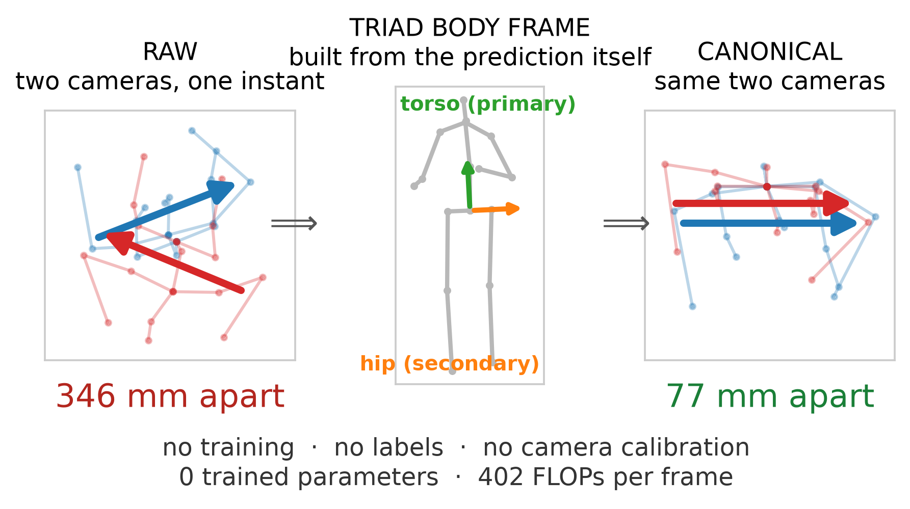

# Training-Free Body-Frame Canonicalization for Cross-View Comparability

**Undergraduate thesis — Computer Science, Comilla University**

Making the output of a *frozen* monocular 3D pose estimator comparable across camera viewpoints, with **no training, no labels, no camera calibration, and zero added parameters.** The estimator is untouched; only the coordinate frame its predictions are expressed in changes.



---

## What this is

Monocular 3D pose estimators return skeletons in the observing camera's coordinate frame, so two cameras watching the same person at the same instant produce two different sets of numbers for the same pose. This project builds a body-fixed frame from the predicted anatomy and applies it *after* prediction, which cancels the camera rotation exactly.

The frame construction is not new — it is the **TRIAD** algorithm from spacecraft attitude determination (Black, 1964), and the rule that the better-determined axis should be primary is due to Shuster & Oh (1981). The propagation of landmark error into frame orientation is established in biomechanics (Della Croce et al., 1999, 2005). **None of that is claimed here.**

What the project contributes is an experimental answer to a narrower question:

> **What determines whether an anatomical reference frame is consistent across viewpoints — and where does that reasoning stop applying?**

The answer is a boundary, established by three pre-registered tests, two of which failed.

---

## Headline results

Human3.6M, 180 held-out camera pairs, subjects S9 and S11, which took no part in developing the method.

**These measure cross-view *agreement* between two camera-relative predictions, not 3D pose accuracy.** The frozen estimator's output is unchanged; only the coordinate frame it is expressed in changes.

| Result | Value |
|---|---|
| Cross-view distance | **372.7 mm → 93.4 mm**, a **72.2 %** reduction (CI [+67.9, +75.5], clustered by subject-action) |
| Pairs improved | **179 / 180** |
| Gap closed to per-frame Procrustes oracle | **87.0 %** (oracle 56.2 mm) |
| Second backbone (MotionBERT, 19× larger, unmodified code) | **75.8 %**, 180 / 180 |
| 3D pose accuracy (MPJPE), before and after | **45.149 mm → 45.149 mm — unchanged** |
| Trained parameters added | **0** |
| Cost per frame | **402 FLOPs** (0.0005 % of the backbone) |

The headline **excludes the four joints the frame is built from** (root, both hips, thorax), because the construction pins them by definition — the thorax canonicalizes at 22.1 mm against 197.5 mm for articulated joints, so a seventeen-joint average flatters the method. Over all seventeen joints the figures are **74.1 %** (XS) and **77.5 %** (MotionBERT), with a 51.3 mm oracle and 90.5 % of the gap closed. Both are reported throughout.

### A simpler baseline beats this method

Kabsch-aligning each pose onto a single fixed reference skeleton is training-free, label-free, calibration-free and single-view — it meets **every** requirement claimed here as this framework's profile.

| | Anatomical frame | Kabsch-to-template |
|---|---|---|
| Cross-view distance (13 joints, XS) | 93.4 mm | **57.5 mm** |
| Camera pairs where it wins | 0 / 180 | **180 / 180** |

It wins on both backbones, all fifteen actions, under three unrelated templates and every centring tested. The criterion and all three readings were committed to git before the experiment ran. This is in the report's abstract, the section "A Single-View Baseline, and It Wins", Limitations and Conclusion, and it is stated here for the same reason.

The method is kept because the baseline **cannot run the experiment this project is about**: Kabsch alignment has no anatomical axis, so there is no axis to hold fixed and vary, and the question of what governs frame consistency cannot be posed inside it. As a way of reducing cross-view distance on this data, the simpler method is better.

All improvement figures are the mean over camera pairs of each pair's own percentage, not the ratio of aggregate means. That convention is the conservative one and is stated in the report; dividing the table entries will not reproduce it.

### The negative results, which are half the thesis

| Claim tested | Outcome |
|---|---|
| Axis length decides *between* frame constructions | **Holds** — on the clean global-frame test, where joint set and constructor count are fixed |
| The per-limb multi-scale improvement (55.1 %) | **Demoted to exploratory** — those frames are built from exactly the joints they are scored on, and sit within 13–23 % of their own Procrustes floor |
| …decides *which frame* within a construction to trust | **Fails** — indistinguishable from a random null |
| …decides *which joint* will disagree | **Fails** — articulation dominates; torso-rigid joints sit at a *larger* radius yet disagree **2.5× less** |
| Temporal bone-length inconsistency predicts error | **Retracted** — ρ = +0.492 on one dataset, +0.098 on the other |
| Test-time augmentation dispersion predicts error | **Fails** all three pre-registered criteria |
| The analytic reliability score predicts accuracy | **Falsified** five independent ways |
| …but does it gate *canonicalization quality*? | **Yes**, on both backbones (reported as exploratory) |
| Does the frame survive distal corruption better than Kabsch? | **Fails its own criterion** — required a crossover on both backbones at ≤ 80 mm noise; got MotionBERT at 40 mm, MotionAGFormer only at 160 mm |
| Does the baseline need a template matching the subject's build? | **No** — scaling the template's limbs to child-like proportions moves it 0.12 mm, 0.2 %. The competitor came out of this stronger |

**Seventeen pre-registered experiments** were committed to version history **before** the experiments they govern, timestamps visible in the git log. **More than half failed their own criteria, and one returned a competing method as the better one** — the report's own wording, so it can be checked against the document rather than against this file. The frozen report describes nine; five more were run after it (`occlusion`, `mismatch`, `anchor_corruption`, `selection`, `misdetect`). Two of those five looked for a regime where this method beats the Kabsch baseline, and neither found one.

---

## Reproducing the claims

```bash
python -m evaluation.audit_numbers      # 304 claims checked against thesis_artifacts/
python -m unittest discover -s tests -q # 76 tests, no model or dataset required
python -m presentation.render --teaser  # regenerate every figure from the artifacts
```

**This is an artifact-consistency audit, not a re-run of the experiments.** It verifies that every number quoted in the report still matches the stored JSON it came from, and fails loudly if one drifts. It does not regenerate model predictions. The figures are drawn from those same artifacts, so a figure cannot disagree with the number it illustrates.

Regenerating the predictions themselves requires the Human3.6M preprocessing and checkpoints described under Setup, and takes considerably longer.

---

## Repository map

**Full file-by-file roadmap: [`REPO_MAP.md`](REPO_MAP.md)** — what every module is for, which artifact it writes, and which report section it backs.

```
canonical/        body-frame construction, multi-scale and multi-landmark variants
evaluation/       one module per experiment, each writing a JSON artifact
  audit_numbers.py        checks all 304 reported claims against artifacts
  h36m_crossview.py       the central cross-view result
  axis_length_law.py      the quantitative fit and its bootstrap
  conditioning_abstention.py  pre-registered abstention test (failed)
  radial_law.py           pre-registered joint-level test (failed)
presentation/
  render.py         all report figures + the two-view comparison, from artifacts
  bvh_export.py     body-relative BVH export
thesis_artifacts/ stored results + sixteen PREREGISTRATION.md files covering seventeen experiments
thesis_report/    the report, DEFENSE_QA.md, FREEZE_CHECKLIST.md
tests/            76 tests, no dataset required
```

---

## Setup

Python 3.11, PyTorch (CPU is sufficient for the demo).

```bash
git clone https://github.com/MHKhanCoU/ViewInvariant-3D-Pose.git
cd ViewInvariant-3D-Pose
python -m venv venv && .\venv\Scripts\activate   # Windows
pip install -r requirements.txt
pip install ultralytics gradio
```

**Dataset** — download [MotionBERT's preprocessed Human3.6M](https://1drv.ms/u/s!AvAdh0LSjEOlgU7BuUZcyafu8kzc?e=vobkjZ), unzip to `data/motion3d/`, then:

```bash
cd data/preprocess && python h36m.py --n-frames 27
```

**Checkpoint** — [MotionAGFormer-XS](https://drive.google.com/file/d/1Pab7cPvnWG8NOVd0nnL1iqAfYCUY4hDH/view?usp=sharing) into `checkpoint/`.

## Usage

```bash
python app.py                                        # Gradio demo
python demo_live/infer_image.py --input image.jpg    # CLI, image
python demo_live/infer_video.py --input video.mp4    # CLI, video

python train.py --eval-only --checkpoint checkpoint \
    --checkpoint-file motionagformer-xs-h36m.pth.tr \
    --config configs/h36m/MotionAGFormer-xsmall.yaml # baseline: 45.149 mm MPJPE
```

The demo's **Coordinate System** toggle offers exactly two options, and the difference between them is the subject of this thesis:

| Option | What it shows |
|---|---|
| `Camera Coordinate System` | the frozen estimator's raw output, in the observing camera's frame |
| `View-Invariant Coordinate System` | the same prediction after body-frame canonicalization |

On CPU, a single image takes about 0.7 s once the models are warm. **Video is far slower — roughly 8 minutes for a 30-second clip** — so render demonstration videos in advance rather than live.

The baseline reproduces the published MotionAGFormer-XS figure to three decimals (45.149 mm against 45.1 mm reported), which is what makes the failed replications in this project interpretable — a negative result is only informative if the apparatus is not what failed.

---

## Limitations, stated plainly

- **The metric measures agreement, not correctness.** Two predictions that are wrong in the same way agree perfectly. The Procrustes oracle floor and the retained correlation with ground-truth error bound this, but do not eliminate it.
- **No downstream task succeeds.** Cross-view retrieval is negative and used a superseded protocol. The project improves a geometric quantity and does not show that improving it improves an application.
- **Two datasets, both laboratory multi-camera rigs; two backbones, both transformers.** "Model-independent" rests on n = 2.
- Single person per frame; no absolute scale; no world-space trajectory.
- The demo is qualitative. All benchmark numbers come from the evaluation modules, not from the demo path.

---

## Related work

| Work | Reference |
|---|---|
| **MotionAGFormer** — backbone | Mehraban, Adeli & Taati, *MotionAGFormer: Enhancing 3D Human Pose Estimation with a Transformer-GCNFormer Network*, WACV 2024. [arXiv](https://arxiv.org/abs/2310.16288) · [code](https://github.com/TaatiTeam/MotionAGFormer) |
| **MotionBERT** — second backbone, preprocessed H36M | Zhu, Ma, Liu, Liu, Wu & Wang, *MotionBERT: A Unified Perspective on Learning Human Motion Representations*, ICCV 2023. [arXiv](https://arxiv.org/abs/2210.06551) · [code](https://github.com/Walter0807/MotionBERT) |
| **VideoPose3D** — 2D-to-3D lifting paradigm | Pavllo, Feichtenhofer, Grangier & Auli, *3D Human Pose Estimation in Video with Temporal Convolutions and Semi-Supervised Training*, CVPR 2019. [arXiv](https://arxiv.org/abs/1811.11742) |
| **P-STMO** — MPI-INF-3DHP preprocessing | Shan, Liu, Zhang, Wang, Wang & Ding, *P-STMO: Pre-Trained Spatial Temporal Many-to-One Model for 3D Human Pose Estimation*, ECCV 2022. [code](https://github.com/paTRICK-swk/P-STMO) |
| **3DPCNet** — closest prior work, learned canonicalization | Ekanayake et al., *3DPCNet: Estimator-Agnostic Canonicalization of 3D Human Pose*, ICASSP 2026. [arXiv](https://arxiv.org/abs/2509.23455) |
| **TRIAD** — the frame construction | Black, *A Passive System for Determining the Attitude of a Satellite*, AIAA Journal 2(7), 1964 |
| **TRIAD covariance, primary-axis rule** | Shuster & Oh, *Three-Axis Attitude Determination from Vector Observations*, J. Guidance and Control 4(1), 1981 |
| **Wahba's problem** | Wahba, *A Least Squares Estimate of Satellite Attitude*, SIAM Review 7(3), 1965 |
| **Landmark error → frame orientation** | Della Croce, Cappozzo & Kerrigan, *Med. Biol. Eng. Comput.* 37(2), 1999; Della Croce, Leardini, Chiari & Cappozzo, *Gait & Posture* 21(2), 2005 |
| **YOLOv8-pose** — 2D front end | Jocher, Chaurasia & Qiu, *Ultralytics YOLOv8*, 2023 |

---

## Citation

```bibtex
@thesis{khan2026canonicalization,
  title  = {A Lightweight, Training-Free Geometric Canonicalization
            Framework for Cross-View Comparability of Frozen Monocular
            3D Pose Predictions},
  author = {Mehedi Hasan Khan},
  school = {Comilla University},
  type   = {Undergraduate thesis},
  year   = {2026}
}
```

Please also cite the backbone you use — MotionAGFormer (Mehraban et al., WACV 2024) or MotionBERT (Zhu et al., ICCV 2023).

## License

Academic research use. The underlying MotionAGFormer code follows the license of the original repository.

## Acknowledgement

Built on the official [MotionAGFormer](https://github.com/TaatiTeam/MotionAGFormer) implementation, with data preprocessing from [MotionBERT](https://github.com/Walter0807/MotionBERT) and [P-STMO](https://github.com/paTRICK-swk/P-STMO), and 2D detection from [Ultralytics YOLOv8](https://github.com/ultralytics/ultralytics). Thanks to the authors for releasing their code.
